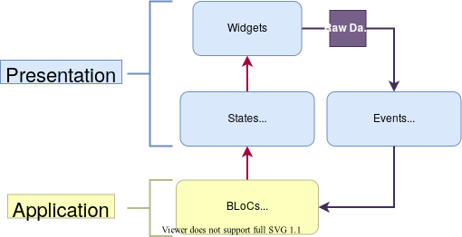

## application layer

- application layer 구조  

 

- BloCs들을 가지고 있는 곳
- States, Events 는 presentation layer에 존재하는 View Model 로 볼수 있음 => BloC 은 application logic을 처리하는 부분
- Stetes, Events 는 presentation Layer 임. 하지만 application 폴더에 포함해도 됨
    - presentation layer 안에 있기 때문에 UI랑 결합도가 높아도 됨!
- States, Events는 application logic 을 담고 있음

- BloC에서는 UI에서 받아오는 이벤트를 State로 전환
